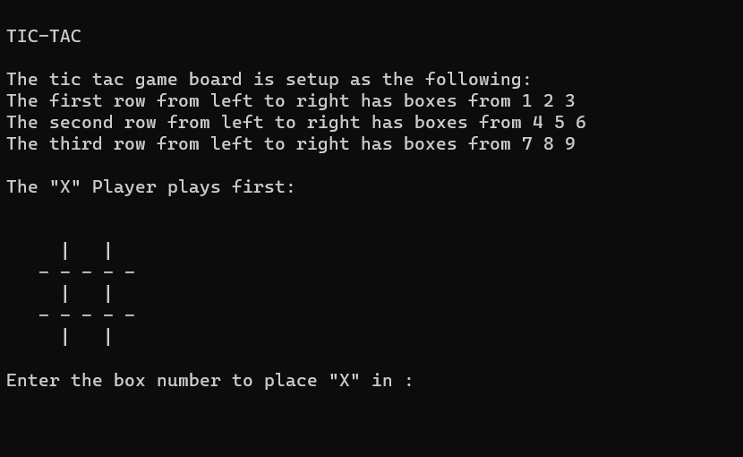
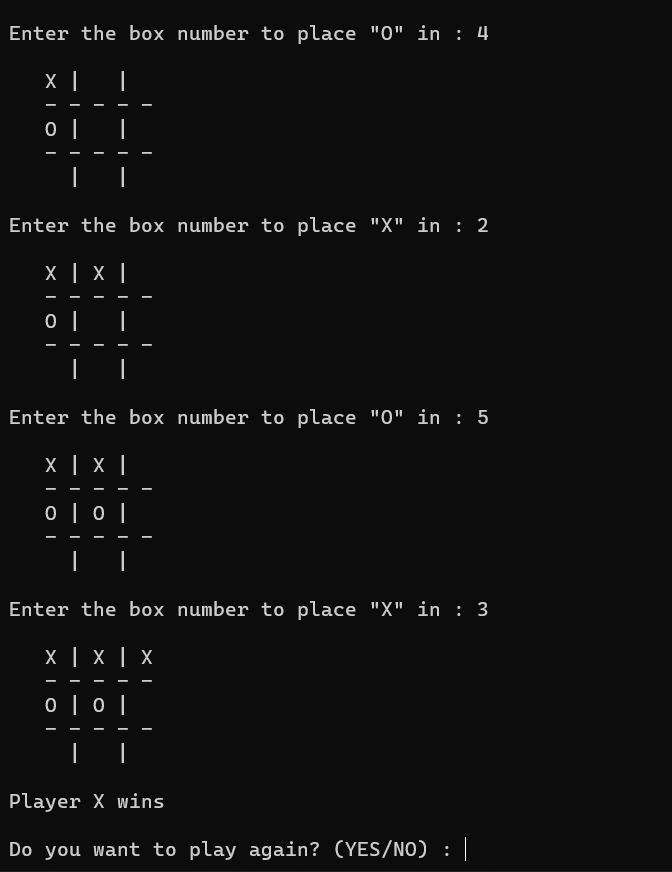

# Tic-Tac-Toe
This is a basic Tic-Tac-Toe game that works on the command-line interface.
It is a 1v1 user game.
1vComputer is yet to be added(in progress)

To play:
Download the code and run on c++ compiler and enjoy the game!!

Screenshot of how game opens : 

Example of how game is played : 

